# Architecture

This document describes the platform architecture for the Nonprofit Resilience Intelligence Platform.

Two diagrams are maintained:

1. The MVP architecture showing what is currently being built.
2. The Vision architecture showing the long term platform roadmap.

---

# MVP Architecture

> **Phase 1 scope — what is actively being built**



**Purpose:** Validate the Capacity Gap Index hypothesis and Financial Resilience Score using IRS Form 990 data.

## What This Phase Includes

| Component | Description |
|----------|-------------|
| IRS Form 990 | Primary data source via ProPublica API |
| Bronze Layer | Raw ingestion, append only, partitioned by filing year |
| Silver Layer | Financial feature engineering and derived metrics |
| Capacity Gap Index | Core research metric measuring community need growth versus organizational capacity growth |
| Financial Resilience Engine | XGBoost and SHAP based resilience scoring engine with a composite score from 0 to 100 |
| Power BI Dashboard | Resilience score, Capacity Gap trend, and peer benchmark visualizations |

## Deferred To Later Phases

The following capabilities are intentionally excluded from the MVP:

- Census demand layer
- Mission Capacity Forecast
- Scenario Simulator
- Stress Signature Classification
- Community Risk Contagion Engine
- AI Executive Advisor

---

# Vision Architecture

> **Full platform — long term research roadmap**



**Purpose:** Long term platform architecture including mission forecasting, scenario simulation, ecosystem risk analysis, and AI assisted decision support.

## Platform Layers

| Layer | Components |
|---------|-------------|
| Sources | IRS Form 990, Census ACS, BLS, USASpending, SNAP, Eviction Lab, USDA ERS, HUD CHAS |
| Bronze | Raw landing layer in OneLake, append only storage |
| Silver | Financial features, Capacity Gap Index, community indicators, and funder network features |
| ML Layer | Financial Resilience Engine, Stress Signature Classification, Mission Capacity Forecast, Community Risk Contagion Engine |
| Decision Intelligence Mart | Composite scores, peer percentiles, SHAP attribution, trajectory labels, and vulnerability metrics |
| Delivery Layer | Executive Dashboard, Scenario Simulator, Mission Capacity View, Ecosystem Risk Map, and Trajectory Signatures |
| AI Executive Advisor | LLM grounded in SHAP values, peer benchmarks, and trajectory signatures with no hallucinated metrics |

---

# Phase Roadmap

| Phase | Scope |
|---------|-------------|
| Phase 1 | IRS Form 990 ingestion, financial feature engineering, Capacity Gap Index, Financial Resilience Engine, and baseline Power BI dashboard |
| Phase 2 | Census demand layer, Mission Capacity Forecast, and Scenario Simulator |
| Phase 3 | Stress Signature Classification, AI Executive Advisor, and peer cohort outcome matching |
| Phase 4 | Funder dependency network, Community Risk Contagion Engine, and ecosystem risk mapping |

---

# Technology Stack

| Category | Tools |
|----------|--------|
| Platform | Microsoft Fabric, OneLake, Spark Notebooks, Data Pipelines |
| Machine Learning | XGBoost, SHAP, Prophet, DTW k-means clustering, NetworkX |
| Experiment Tracking | MLflow |
| Delivery | Power BI using Direct Lake semantic models |
| AI Layer | LLM API grounded in computed model outputs and explainable model signals |

---

# Core Research Innovations

## Capacity Gap Index

The primary research contribution of this project.

The Capacity Gap Index measures the divergence between community need growth and organizational capacity growth.

### Research Hypothesis

```text
Community Need Growth Rate
            minus
Organization Capacity Growth Rate
            equals
Capacity Gap Index
